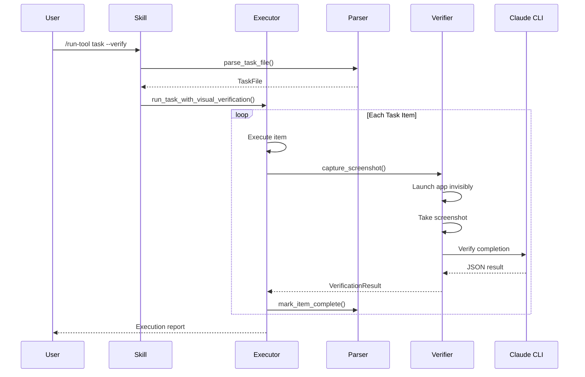

# Codebase Map

> Auto-generated by Cartographer. Last mapped: 2026-01-14

## System Overview

```mermaid
graph TB
    subgraph Commands
        LT[/list-tools]
        RT[/run-tool]
        VT[/verify-tool]
    end

    subgraph Skills
        SK[SKILL.md]
    end

    subgraph Scripts
        PA[parser.py]
        EX[executor.py]
        VV[visual_verifier.py]
        RE[reporter.py]
    end

    subgraph External
        CLI[Claude CLI]
        BR[Headless Browser]
        PS[PowerShell]
    end

    subgraph Data
        TF[.claude/*.md Task Files]
        SS[Screenshots]
    end

    LT --> PA
    RT --> EX
    VT --> VV
    VT --> RE

    SK --> LT
    SK --> RT
    SK --> VT

    EX --> PA
    EX --> VV
    RE --> PA

    VV --> CLI
    VV --> BR
    VV --> PS

    PA --> TF
    EX --> TF
    VV --> SS
```

## Directory Structure

```
tool-reader/
├── .claude-plugin/
│   ├── manifest.json      # Plugin definition, commands, triggers
│   └── marketplace.json   # Distribution metadata
├── plugins/tool-reader/
│   ├── commands/
│   │   ├── list-tools.md  # /list-tools documentation
│   │   ├── run-tool.md    # /run-tool documentation
│   │   └── verify-tool.md # /verify-tool documentation
│   ├── scripts/
│   │   ├── parser.py      # Task file parsing
│   │   ├── executor.py    # Task execution engine
│   │   ├── visual_verifier.py  # Screenshot & verification
│   │   └── reporter.py    # Status report generation
│   ├── skills/
│   │   └── SKILL.md       # Agent instructions
│   └── README.md          # Plugin overview
├── docs/
│   └── CODEBASE_MAP.md    # This file
├── .gitignore
└── README.md              # Repository README
```

## Module Guide

### Configuration (.claude-plugin/)

| File | Purpose | Tokens |
|------|---------|--------|
| manifest.json | Plugin metadata, commands, triggers | 95 |
| marketplace.json | Distribution/marketplace info | 199 |

### Commands (plugins/tool-reader/commands/)

| File | Purpose | Tokens |
|------|---------|--------|
| list-tools.md | Scans .claude/ for task files | 381 |
| run-tool.md | Executes tasks with visual verification | 1221 |
| verify-tool.md | Verifies completion via screenshots | 1321 |

### Scripts (plugins/tool-reader/scripts/)

#### parser.py
**Purpose**: Parses markdown task files and extracts checklist items

**Exports**:
- `ChecklistItem` - Dataclass for checklist items
- `TaskFile` - Dataclass with computed properties (progress, status)
- `parse_task_file()` - Main parser function
- `find_task_files()` - Discovers task files
- `list_all_tasks()` - Lists and parses all tasks

**Dependencies**: None (stdlib only)

---

#### executor.py
**Purpose**: Core execution engine with visual verification support

**Exports**:
- `ExecutionResult` - Result dataclass
- `mark_item_complete()` - Updates file to mark [x]
- `run_task()` - Basic execution
- `run_task_with_visual_verification()` - Execution with Claude CLI verification

**Dependencies**: parser.py, visual_verifier.py

---

#### visual_verifier.py
**Purpose**: Invisible screenshot capture and Claude CLI verification

**Exports**:
- `AppType` - Enum (GUI, TUI, WEBAPP)
- `detect_app_type()` - Detects from task markers
- `capture_screenshot_webapp()` - Headless browser capture
- `capture_screenshot_window()` - GUI window capture via PrintWindow
- `launch_tui_invisible()` - Hidden CLI execution
- `verify_with_claude()` - Claude CLI integration
- `run_visual_verification()` - Main entry point

**Dependencies**: None (stdlib + system tools)

---

#### reporter.py
**Purpose**: Generates status reports and summaries

**Exports**:
- `verify_task()` - Single task report
- `generate_summary_report()` - All tasks overview
- `check_completion()` - Validation helper

**Dependencies**: parser.py

### Skills (plugins/tool-reader/skills/)

| File | Purpose | Tokens |
|------|---------|--------|
| SKILL.md | Agent behavior instructions | 1712 |

## Data Flow



## Conventions

### Task File Format
```markdown
# Task Name

## Application
[webapp]: http://localhost:3000
[gui]: app.exe
[tui]: npm run dev

## Acceptance Criteria
- Criteria 1
- Criteria 2

## Checklist
- [ ] Uncompleted item
- [x] Completed item
```

### Status States
- `NO_ITEMS` - No checklist items found
- `NOT_STARTED` - 0 items completed
- `IN_PROGRESS` - Some items completed
- `COMPLETE` - All items completed

### Invisible Capture Techniques
- **Webapp**: Headless Chrome/Edge (`--headless=new`)
- **GUI**: PowerShell `WindowStyle.Hidden` + `PrintWindow` API
- **TUI**: `CREATE_NO_WINDOW` subprocess flag

## Gotchas

1. **Windows paths**: Use `expand_path()` to resolve short names (KEVINM~1)
2. **Browser detection**: Falls back Edge → Chrome, checks standard install paths
3. **PowerShell compilation**: Must add `-ReferencedAssemblies System.Drawing` for Bitmap
4. **Focus steal**: GUI apps launched minimized, not hidden (PrintWindow needs rendered content)
5. **Claude CLI**: No `--image` flag - use file path in prompt for Read tool

## Navigation Guide

**To add a new command**:
1. Create `plugins/tool-reader/commands/<name>.md`
2. Add command to `.claude-plugin/manifest.json`
3. Document usage and examples

**To add a new capture method**:
1. Add enum value to `AppType` in `visual_verifier.py`
2. Add detection pattern in `detect_app_type()`
3. Create `capture_screenshot_<type>()` function
4. Add case in `run_visual_verification()`

**To modify task parsing**:
1. Edit regex patterns in `parser.py`
2. Update `ChecklistItem` or `TaskFile` dataclasses
3. Test with various markdown formats
